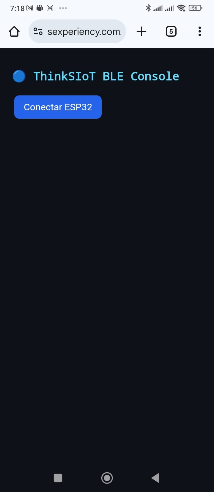
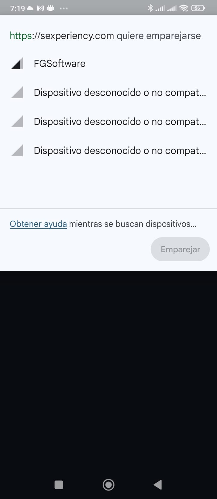
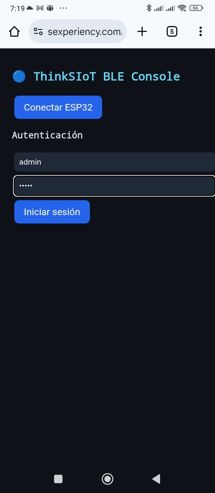
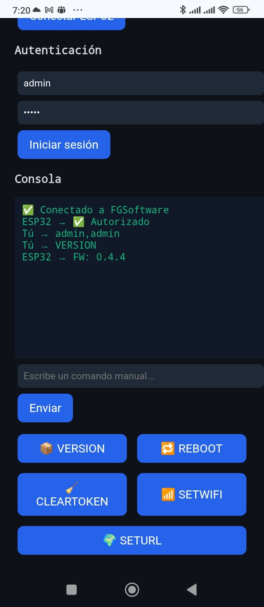
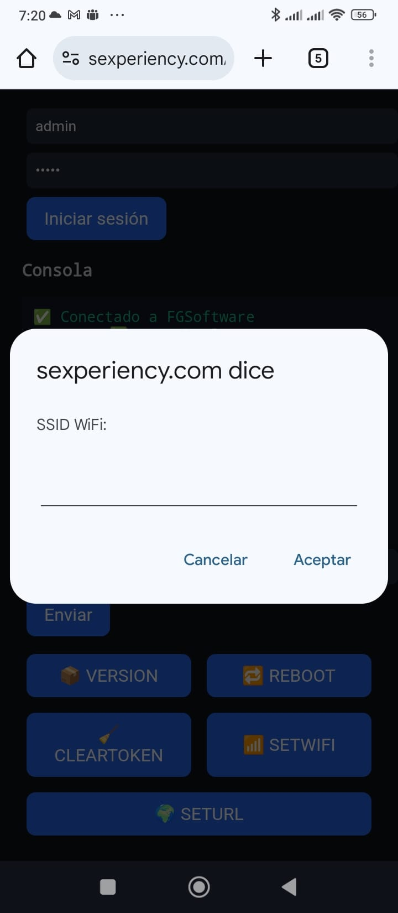

# 🌐 Guía de uso de la WebApp ThinkSIoT Instaladores

La **WebApp** le permite configurar su dispositivo IoT de forma rápida y sencilla, directamente desde su teléfono móvil mediante **Bluetooth**.

A continuación se detallan los pasos para realizar la configuración inicial del dispositivo:

---

## 🧭 1. Acceso a la WebApp
Haga clic en el enlace proporcionado para abrir la aplicación web:  
👉 [acceso](https://sexperiency.com/conexion.html)

o bien escanee el siguiente código QR desde su movil


> 💡 **Consejo:** Use el navegador de su móvil.  
> La aplicación está optimizada para **Android y iOS**.  
> Si accede desde un **ordenador**, este debe disponer de **Bluetooth** y ser **compatible con Web Bluetooth** para poder configurar el dispositivo ESP32.  
> En caso contrario, **no será posible completar la configuración**.




---

## 📡 2. Escaneo de dispositivos Bluetooth
Cuando se cargue la WebApp, pulse en el botón **“Conectar ESP32”**.  
El sistema solicitará permiso para acceder al Bluetooth del móvil:  
- Active el Bluetooth si no lo tiene encendido.  
- Asegúrese de que su teléfono es **compatible con Web Bluetooth API** (disponible en la mayoría de navegadores modernos).

Una vez concedidos los permisos, se abrirá una ventana como la que se muestra a continuación, con una **lista de todos los dispositivos Bluetooth detectados** en el entorno.  
De esa lista, deberá seleccionar el dispositivo identificado como **`FGSoftware`** para continuar con el proceso de emparejamiento.




---


## 🔗 3. Conexión e inicio de sesión
Una vez seleccionado el dispositivo **FGSoftware**, la WebApp establecerá automáticamente la conexión Bluetooth BLE con el equipo.  
Este proceso puede tardar unos segundos mientras se intercambian los servicios y características necesarias para la comunicación.

Tras la conexión, aparecerá la **pantalla de inicio de sesión**, donde deberá introducir las credenciales predeterminadas:

- **Usuario:** `admin`  
- **Contraseña:** `admin`

> ⚠️ Por motivos de seguridad, se recomienda cambiar estas credenciales después de la primera configuración.




---

## ✅ 4. Conexión y autorización correctas
Si el **usuario** y la **contraseña** se han introducido correctamente, la WebApp mostrará una pantalla similar a la siguiente:


En esta ventana puede verse:
- Un mensaje de confirmación ✅ **“Conectado a FGSoftware”**, indicando que la comunicación BLE con el dispositivo ESP32 se ha establecido correctamente.  
- El estado ✅ **“Autorizado”**, que confirma que las credenciales son válidas.  
- Los datos del usuario con el que se ha iniciado sesión (`admin, admin`).  

Además, esta pantalla incluye una **consola** interactiva donde los técnicos pueden introducir **comandos de ingeniería** más avanzados (por ejemplo comandos de diagnóstico, lectura de variables internas o envío de instrucciones específicas). Debajo de la consola hay un campo de texto para escribir comandos manuales y un botón **Enviar** para ejecutarlos.

También encontrará una fila de **botones de acceso directo** que ejecutan automáticamente los comandos más usados (por ejemplo `VERSION`, `REBOOT`, `SETWIFI`, etc.), pensados para agilizar las tareas habituales sin tener que escribir los comandos manualmente.

> ⚠️ Use la consola con precaución: algunos comandos avanzados pueden alterar la configuración del dispositivo o provocar reinicios.


---

# 🧱 5. Consulta de la versión del firmware (opcional)

Este paso **no es obligatorio** para la configuración del dispositivo, pero sirve como ejemplo práctico para comprobar el funcionamiento del sistema y de la consola de comandos.

Una vez conectado y autorizado, puede utilizar los botones de acceso rápido para ejecutar comandos predefinidos sin necesidad de escribirlos manualmente.

Por ejemplo, al pulsar el botón **📦 VERSION**, la WebApp enviará automáticamente el comando `VERSION` al dispositivo.  
En la **consola** se mostrará la respuesta confirmando la versión actual del firmware instalado en el ESP32, como se observa en la imagen siguiente:



En este caso, el dispositivo responde:

```
ESP32 → FW: 0.4.4
```

Esto indica que el firmware instalado en el equipo es la versión **0.4.4**, lo cual permite verificar rápidamente que el dispositivo se encuentra actualizado y que la comunicación BLE funciona correctamente.

> 💡 **Nota:** Este comando se usa únicamente como demostración y no es necesario para el proceso de configuración del dispositivo.

---

# ⚙️ 6. Configuración de la red Wi-Fi (SETWIFI)

Desde el menú principal, seleccione el comando **SETWIFI** para iniciar el proceso de configuración de la conexión inalámbrica del dispositivo.

Al pulsar el botón **SETWIFI**, la WebApp mostrará una ventana emergente donde deberá introducir el **nombre de la red Wi-Fi (SSID)** a la que desea conectar el dispositivo.



Una vez introducido el SSID y confirmado el cuadro de diálogo, se solicitará la **contraseña de acceso a la red Wi-Fi**.


Introduzca la contraseña correspondiente y pulse **Aceptar** para completar el proceso.  
Si los datos son correctos, el dispositivo intentará conectarse automáticamente a la red seleccionada y, en pocos segundos, quedará vinculado a la plataforma ThinkSIoT.

---

## 💻 Configuración avanzada desde la consola
De forma alternativa, también es posible establecer la red Wi-Fi **manualmente** a través de la consola de comandos.

Para ello, introduzca la siguiente instrucción en la línea de comandos:

```
SETWIFI:ssid,pass
```

Donde:
- **ssid** → es el nombre de la red Wi-Fi.
- **pass** → es la contraseña de dicha red.

> ⚠️ **Importante:**  
> - Debe respetarse la sintaxis exacta del comando:  
>   - Después de `SETWIFI` deben ir **dos puntos (`:`)**.  
>   - Entre el **SSID** y la **contraseña** debe colocarse una **coma (`,`)**.  
>   - Todo el comando debe escribirse **en una sola línea y sin espacios**.  
>
> Ejemplo:
> ```
> SETWIFI:MiRedWiFi,contraseña1234
> ```

---

> 💡 **Consejo:**  
> Si la conexión no se establece correctamente, verifique que el SSID y la contraseña sean correctos y que la señal Wi-Fi esté dentro del rango del dispositivo.


---

## ✅ 7. Conexión completada
Si los datos son correctos, el dispositivo se conectará automáticamente a la red Wi-Fi y, en pocos segundos, aparecerá **conectado a la plataforma ThinkSIoT**.


---

## 🎯 ¡Listo!
Su dispositivo está ahora vinculado y transmitiendo datos a la plataforma.

En caso de cualquier inconveniente, asegúrese de:
- Estar cerca del dispositivo al emparejarlo.  
- Introducir correctamente el SSID y la contraseña.  
- Tener acceso a internet en la red seleccionada.

---

📧 **Soporte técnico:** soporte@thinksiot.com  
🌐 **Sitio web:** [https://](https://)

---

© 2025 **ThinkSIoT** — Todos los derechos reservados.


